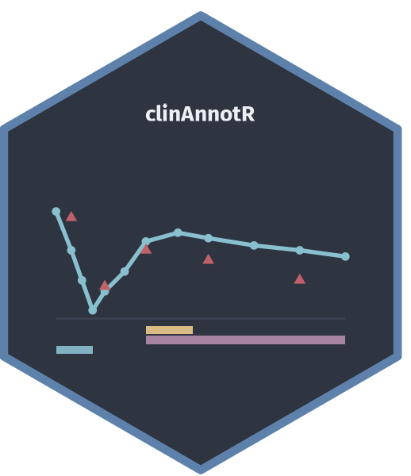
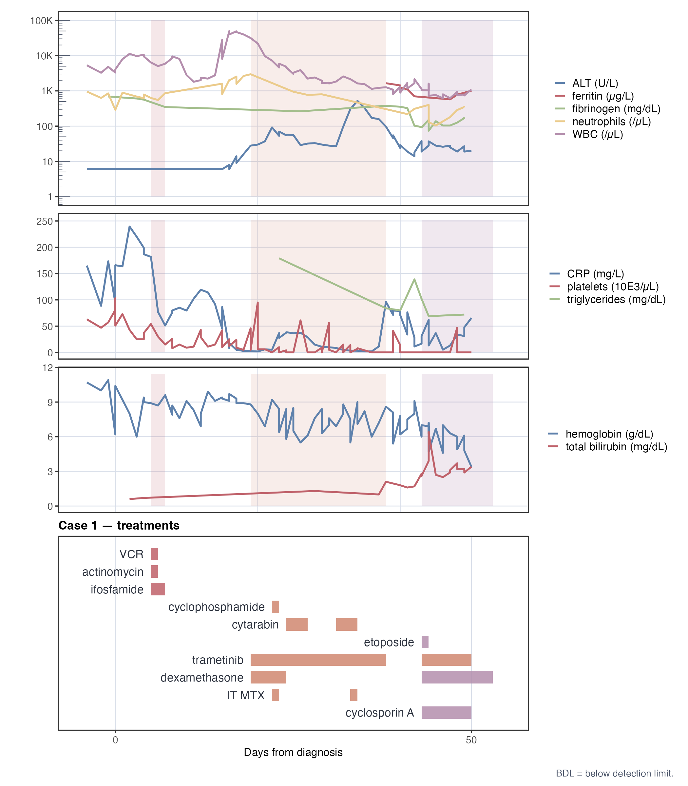

# clinAnnotR

<p align="center"></p>

Disclaimer: I manually built the layout of the figure, and I asked claude code to turn this layout into an R package.

R package for generating publication-quality multi-panel clinical figures that combine **any numerical laboratory time-series** with per-case **treatment Gantt charts**.



*Published case report data. Generated by [`example.R`](example.R).*

---

## Features

- Any lab parameter shown as a **line**, a **point series**, or both — no hardcoded parameter names
- **log₁₀ and linear** y-axes per panel, mixed across panels in the same figure
- **Below-detection-limit** (BDL) values (`<X` notation) automatically flagged with a dedicated open-triangle symbol (∇)
- Optional **direct value labels** on points via ggrepel
- **Single-case mode**: colour mapped to **parameter** (each parameter gets a distinct colour, all lines solid); multi-case mode maps colour to case
- **Treatment Gantt charts** with multi-segment bars (repeated cycles), custom colours, and drug name labels
- **Gantt height auto-scaled** per case based on number of treatment rows (`max(1.5, n_treatments × 0.4)`)
- **Drug class grouping**: rows ordered by class (earliest class start first); duplicate segments silently removed
- **Shared x-axis**; supports **negative relative days** (measurements before day 0); optional vertical reference lines and **per-case background shading regions** (e.g. treatment phases)
- Every visual element configurable: colours, shapes, axis ranges, BDL floor, label sizes, bar heights, and more

---

## Installation

```r
# install.packages("devtools")
devtools::install_github("rmvpaeme/clinAnnotR")
```

---

## Quick start

```r
library(clinAnnotR)
library(readxl)

# Load data from Excel (standard format: relative days)
lab <- prep_lab_data(read_excel("labvals.xlsx"))
tx  <- prep_treatment_data(read_excel("treatment.xlsx"))

# Define panels
panels <- list(
  lab_panel(
    line_params   = c("WBC (/µL)", "neutrophils (/µL)"),
    y_scale       = "log10",
    y_label       = "Count (/µL)",
    height_weight = 4
  ),
  lab_panel(
    line_params   = c("CRP (mg/L)", "ferritin (µg/L)"),
    y_scale       = "log10",
    y_label       = "Inflammation",
    height_weight = 3
  )
)

# Assemble and save
fig <- make_clinical_figure(
  lab_data       = lab,
  treatment_data = tx,
  lab_panels     = panels,
  x_range        = c(-5, 60)
)

save_clinical_figure(fig, "figure.pdf")
save_clinical_figure(fig, "figure.png", dpi = 300)
```

---

## Real-data example

The repository ships a complete worked example in [`example_casereport/`](example_casereport/)
based on a published case report. The figure above was produced by:

```r
source("example.R")
```

[`example.R`](example.R) shows how to load the two Excel files, define panels, and save the figure.

---

## Input data format

All data uses **relative days** (integer or numeric days from a reference date, e.g. diagnosis).
Two files are needed: one for lab values, one for treatments.

### Lab values — `labvals.xlsx`

One row per measurement per parameter per case. Columns:

| Column | Type | Notes |
| -------- | ------ | ------- |
| `case_id` | character | Case identifier (e.g. `"Case 1"`) |
| `relday` | numeric | Days from reference date (negative = before day 0) |
| `parameter` | character | Measurement label, used in panel specs and legends |
| `value` | numeric or character | Supports `<X` notation for below-detection-limit values |

Example:

```text
case_id    relday    parameter          value
Case 1     -4        WBC (/µL)          12400
Case 1      0        WBC (/µL)          8300
Case 1      5        ferritin (µg/L)    4200
Case 1     14        CRP (mg/L)         <5
```

```r
lab <- prep_lab_data(read_excel("labvals.xlsx"))
```

See [`inst/extdata/example_labvals.csv`](inst/extdata/example_labvals.csv) and
[`example_casereport/labvals.xlsx`](example_casereport/labvals.xlsx) for complete examples.

### Treatment data — `treatment.xlsx`

One row per treatment segment. Rows with the same `TREATMENT` name produce a multi-segment bar. Columns:

| Column | Type | Notes |
| -------- | ------ | ------- |
| `case_id` | character | Must match `case_id` in lab data |
| `TREATMENT` | character | Drug name; repeated rows → multi-segment Gantt bar |
| `START_rel` | numeric | Segment start (days from reference date) |
| `END_rel` | numeric | Segment end (days from reference date) |
| `COLOR` | character | Hex fill colour (e.g. `#88C0D0`) |
| `CLASS` | character | Drug class label — controls row grouping in Gantt |

Example:

```text
case_id    TREATMENT       START_rel    END_rel    COLOR      CLASS
Case 1     trametinib      19           38         #D08770    MEK inhibitor
Case 1     trametinib      43           50         #D08770    MEK inhibitor
Case 1     dexamethasone   19           24         #D08770    corticosteroid
Case 1     dexamethasone   43           53         #B48EAD    corticosteroid
Case 1     cytarabin       24           27         #D08770    chemotherapy
```

```r
tx <- prep_treatment_data(read_excel("treatment.xlsx"))
```

See [`inst/extdata/example_treatment.csv`](inst/extdata/example_treatment.csv) and
[`example_casereport/treatment.xlsx`](example_casereport/treatment.xlsx) for complete examples.

### Loading from CSV

The same column names work for CSV files:

```r
lab <- prep_lab_data(read.csv("labvals.csv"))
tx  <- prep_treatment_data(read.csv("treatment.csv"))
```

### Loading from Excel with absolute dates (optional)

If your Excel file contains absolute dates, use `load_lab_data()` / `load_treatment_data()`.
These compute relative days automatically given a reference date per case:

```r
cases <- list(
  list(id = "Case 1", ref_date = "2025-06-03"),
  list(id = "Case 2", ref_date = "2025-08-12")
)
lab <- load_lab_data("labvals_dates.xlsx", cases)
tx  <- load_treatment_data("treatment_dates.xlsx", cases)
```

Required columns: a patient ID column (default `"patientID"` / `"PATIENTID"`), an absolute
date column (`"date"`), and optionally a separate time column (`"time"`). Pass `col_time = NULL`
if datetime is already combined in the date column.

---

## Panel specification

Each lab panel is defined with `lab_panel()`:

| Argument | Default | Description |
|----------|---------|-------------|
| `line_params` | `character(0)` | Parameters shown as connected lines |
| `point_params` | `character(0)` | Parameters shown as points only |
| `y_scale` | `"log10"` | `"log10"` or `"linear"` |
| `y_label` | `NULL` | y-axis title (NULL = first parameter name) |
| `y_limits` | `NULL` | `c(lo, hi)` — NULL = auto |
| `y_breaks` | `NULL` | Numeric break positions — NULL = auto |
| `y_labels` | `NULL` | Break labels — NULL = auto |
| `show_labels` | `FALSE` | Draw ggrepel value labels on points |
| `label_suffix` | `""` | Appended to value labels (e.g. `"%"`) |
| `bdl_floor` | `NULL` | Floor for BDL values on log axis (default `0.1`) |
| `highlight_days` | `NULL` | Per-panel override of global reference lines |
| `height_weight` | `3` | Relative height in figure stack |

```r
# Log scale, multiple parameters
lab_panel(
  line_params   = c("ALT (U/L)", "ferritin (µg/L)", "WBC (/µL)"),
  y_scale       = "log10",
  y_label       = "Lab values",
  height_weight = 4
)

# Linear scale with value labels on points
lab_panel(
  point_params  = "BM blasts (%)",
  y_scale       = "linear",
  y_limits      = c(0, 100),
  show_labels   = TRUE,
  label_suffix  = "%",
  height_weight = 3
)

# Lines + points together, custom y-axis breaks
lab_panel(
  line_params   = "Albumin (g/L)",
  point_params  = "Albumin (g/L)",
  y_scale       = "linear",
  y_breaks      = c(20, 30, 40, 50),
  height_weight = 2
)
```

---

## Figure assembly

```r
fig <- make_clinical_figure(
  lab_data            = lab,
  treatment_data      = tx,       # NULL = no Gantt panels
  lab_panels          = panels,
  cases               = NULL,     # NULL = all cases in lab_data
  case_palette        = NULL,     # NULL = auto (Nord-inspired)
  case_shapes         = NULL,     # NULL = auto
  x_range             = NULL,     # NULL = auto (data range ± 5 days)
  highlight_days      = NULL,     # named numeric vector of reference lines
  shade_regions       = NULL,     # named list of background rectangles per case
  gantt_height_weight = NULL,     # NULL = auto per case; or fixed number
  base_size           = 9
)
```

**Background shading per case** (drawn on all lab panels):

```r
fig <- make_clinical_figure(
  lab, tx, panels,
  shade_regions = list(
    "Case 1" = list(
      list(xmin = 5,  xmax = 7,  fill = "#BF616A", alpha = 0.15),
      list(xmin = 19, xmax = 38, fill = "#D08770", alpha = 0.15)
    ),
    "Case 2" = list(
      list(xmin = 19, xmax = 38, fill = "#D08770", alpha = 0.15)
    )
  )
)
```

**Multi-case figure with custom colours:**

```r
fig <- make_clinical_figure(
  lab, tx, panels,
  case_palette   = c("Case 1" = "#1B7837", "Case 2" = "#762A83"),
  case_shapes    = c("Case 1" = 16L,       "Case 2" = 17L),
  x_range        = c(-5, 180),
  highlight_days = c("D1" = 1, "D22" = 22, "D49" = 49)
)
```

**Lab-only figure (no Gantt):**

```r
fig <- make_clinical_figure(lab, treatment_data = NULL, panels)
```

---

## Saving

```r
save_clinical_figure(fig, "figure.pdf")                       # 7 × 8 in, vector
save_clinical_figure(fig, "figure.png",  dpi = 150)          # raster, screen
save_clinical_figure(fig, "figure.png",  dpi = 300)          # raster, print
save_clinical_figure(fig, "figure.tiff", dpi = 600)          # high-res raster
save_clinical_figure(fig, "figure.svg",  width = 14, height = 16)
```

The file extension determines the device automatically.

---

## Advanced: building panels manually

For full control, call the panel functions directly and assemble with [patchwork](https://patchwork.data-imaginist.com/):

```r
library(patchwork)

p1 <- make_timeseries_panel(
  lab_data  = lab,
  spec      = lab_panel(line_params = "WBC (/µL)", y_label = "Count (/µL)"),
  x_range   = c(-5, 60)
)

p2 <- make_gantt_panel(
  treatment_data = tx[tx$case_id == "Case 1", ],
  case_label     = "Case 1 \u2014 treatments",
  x_range        = c(-5, 60),
  show_x         = TRUE
)

(p1 / p2) + plot_layout(heights = c(3, 1.5))
```

---

## Dependencies

```r
install.packages(c(
  "ggplot2", "ggrepel", "patchwork", "scales", "readxl",
  "dplyr", "tibble", "rlang"
))
```

---

## Original script

The original standalone R script (before packaging) is preserved at
[`inst/scripts/figure_combined.R`](inst/scripts/figure_combined.R).
